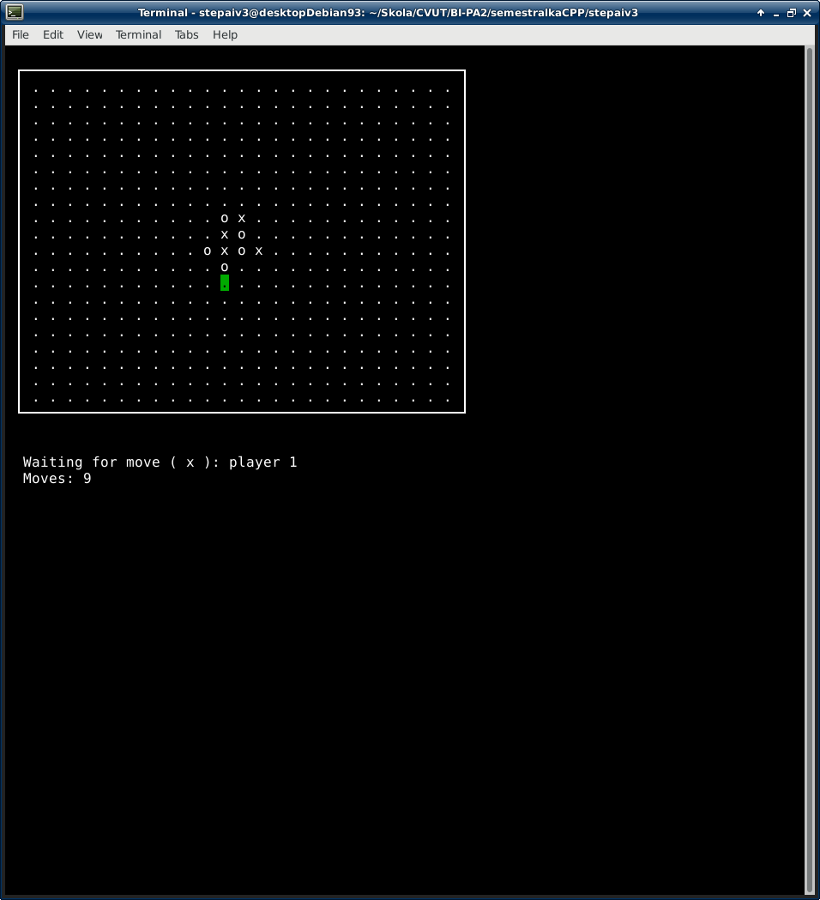

# Five-In-a-Row
This is a school project implementing a classic five in a row (gomoku) game. The game is intended to be run in Linux environment.

# Dependencies
You have to install ncurses for GUI and doxygen with graphviz for generating documentation.

# Compiling and launching
From destination where the Makefile is located write in terminal:
```
make run
```

# Screenshots




